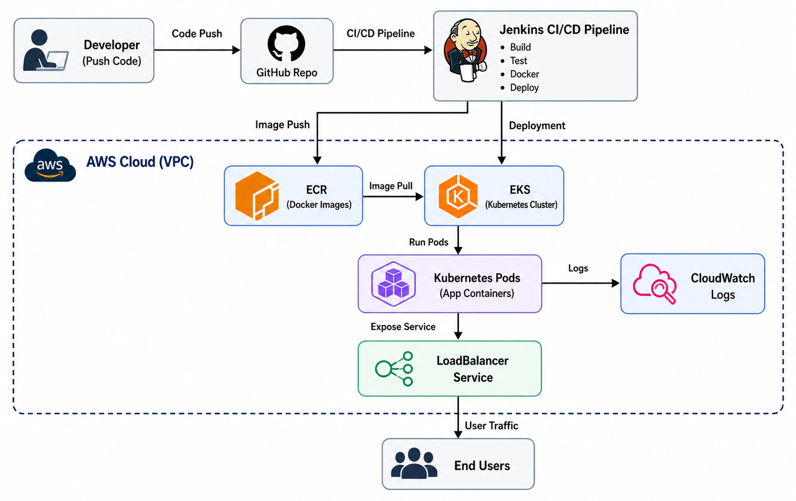

# ✅ SOLUTION TO THE DEVOPS ENGINEER PRACTICAL CHALLENGE - PRODUCTION READY DEPLOYMENT 

## 📌 Overview

This project demonstrates a production-style DevOps setup where a containerized application is automatically built, tested, and deployed to AWS using a CI/CD pipeline.

The solution emphasizes:

* Automation
* Infrastructure as Code
* Clean architecture
* Reproducibility

---

## ✅ BELOW ARE SOLUTIONS TO THE ASSESSMENT

📐 Architectural Diagram


## 🏗️ Architecture Overview

The system follows a CI/CD workflow:

1. Developer pushes code to GitHub
2. Jenkins pipeline is triggered
3. Application is built and containerized using Docker
4. Image is pushed to Amazon ECR
5. Deployment is applied to Amazon EKS
6. Application runs in Kubernetes Pods
7. Service is exposed via AWS LoadBalancer
8. Logs are collected via CloudWatch

---

## ⚙️ Tech Stack

* **Cloud Provider:** AWS
* **Infrastructure as Code:** Terraform
* **Containerization:** Docker
* **Orchestration:** Kubernetes (EKS)
* **CI/CD:** Jenkins
* **Monitoring:** AWS CloudWatch
* **Application:** Node.js (Express)

---

## 🚀 Setup & Deployment Steps

### 1. Clone Repository

```bash
git clone https://github.com/adigwe-michael/devops-assessment.git
cd devops-assessment
```

---

### 2. Provision Infrastructure (Terraform)

```bash
cd terraform/envs/dev
terraform init
terraform apply
```

---

### 3. Configure kubectl

```bash
aws eks --region us-east-1 update-kubeconfig --name devops-eks
kubectl get nodes
```

---

### 4. Build & Push Docker Image (Manual Test)

```bash
aws ecr get-login-password --region us-east-1 \
| docker login --username AWS --password-stdin <123456789012>.dkr.ecr.us-east-1.amazonaws.com

docker build -t devops-assessment-app .
docker tag devops-assessment-app:latest <123456789012.dkr.ecr.us-east-1.amazonaws.com/devops-assessment-app>:latest
docker push <ECR_URI = 123456789012.dkr.ecr.us-east-1.amazonaws.com/devops-assessment-app>:latest
```

---

### 5. Deploy to Kubernetes

```bash
kubectl apply -f k8s/
kubectl get pods
kubectl get svc
```

Access the application via the LoadBalancer URL.

---

## 🔁 CI/CD Pipeline Flow

The Jenkins pipeline automates the entire deployment process:

1. **Checkout Code** from GitHub
2. **Build Application**
3. **Run Basic Tests**
4. **Build Docker Image**
5. **Authenticate with AWS ECR**
6. **Push Image to ECR**
7. **Update Kubernetes Deployment**
8. **Deploy to EKS Cluster**

This ensures every code change is automatically deployed without manual intervention.

---

## 🧠 Design Decisions

### Why EKS?

Amazon EKS provides a managed Kubernetes service, enabling scalability, high availability, and alignment with real-world production environments.

---

### Why Terraform Modules?

Terraform modules were used to:

* Promote reusability
* Maintain clean separation of concerns
* Simplify infrastructure management

---

### Why Jenkins?

Jenkins was selected due to:

* Flexibility in pipeline configuration
* Wide industry adoption
* Strong integration with Docker and Kubernetes

---

### Why Docker + ECR?

Containerization ensures:

* Consistent environments across development and production
* Easy deployment and scaling
* Seamless integration with Kubernetes

---

## 📊 Monitoring & Logging

Application logs are accessible via:

* Kubernetes logs (`kubectl logs`)
* AWS CloudWatch (for centralized monitoring)

---

## ⚠️ Assumptions

* AWS CLI is configured with appropriate permissions
* Terraform is installed
* Docker is installed and running
* Jenkins has required plugins and AWS access

---

## 🚧 Limitations

* No HTTPS (TLS) configured
* No autoscaling (HPA) implemented
* No Helm charts (raw manifests used)
* Basic monitoring only

---

## 🔮 Future Improvements

* Add Ingress Controller with domain support
* Implement Horizontal Pod Autoscaler (HPA)
* Use Helm for better deployment management
* Add advanced monitoring (Prometheus + Grafana)
* Implement blue/green or canary deployments

---

## 📌 Conclusion

This project demonstrates a complete DevOps workflow from infrastructure provisioning to automated deployment using industry-standard tools and practices.

The focus was on simplicity, automation, and clarity while maintaining a production-oriented design.
